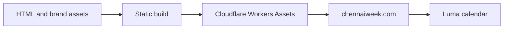

# ChennAI Week


[Chennai AI Week](https://chennaiweek.com/) brings builders, researchers and communities together to explore artificial intelligence across the city. The wordmark **ChennAI Week** shares the AI in Chennai with artificial intelligence.

[Follow the Luma calendar](https://luma.com/chennaiweek). Dates and programme details will be announced when ready.

## Development

Native HTML, CSS and JavaScript. No framework runtime is required.

```sh
npm run validate
npm run build
npm run serve
```

## Website structure



The build includes only the current website assets. Brand assets are available at `/media-kit/`. Space Grotesk is distributed with its SIL Open Font License.
