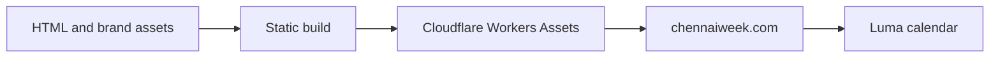

# ChennAI Week


[Chennai AI Week](https://chennaiweek.com/) brings builders, researchers and communities together to explore artificial intelligence across the city. The wordmark **ChennAI Week** shares the AI in Chennai with artificial intelligence.

[Follow the Luma calendar](https://luma.com/chennaiweek). Dates and programme details will be announced when ready.

## Development

Native HTML, CSS and JavaScript. No framework runtime is required.

```sh
npm run validate
npm run build
npm run serve
```

## Website structure



The homepage pairs a typographic introduction with a Chennai illustration, followed by the citywide format, programme directions and a host invitation. The original imagegen illustration is retained at `assets/chennai-ai/city-art.webp`; responsive WebP variants support smaller screens. It is conceptual artwork, not event photography.

The build includes only the current website assets. Brand assets are available at `/media-kit/`. Space Grotesk is self-hosted as WOFF2 and distributed with its SIL Open Font License. System light/dark preferences, an optional theme switch, keyboard navigation and reduced-motion preferences are supported. Essential content and links work without JavaScript.

## Deployment

GitHub retains the source; Cloudflare Workers serves the website. Validate the approved batch and push it to `stage`. Open and review a `stage` to `main` pull request, preserving a merge commit. After merging, fast-forward `stage` to the production merge. From the clean merged source, run `npm run validate`, `npm run build`, then `npx wrangler deploy` using the authorised Cloudflare account. Verify the live pages and canonical redirects. Deployment is manual; a Git push alone does not deploy. GitHub Pages is not used.
